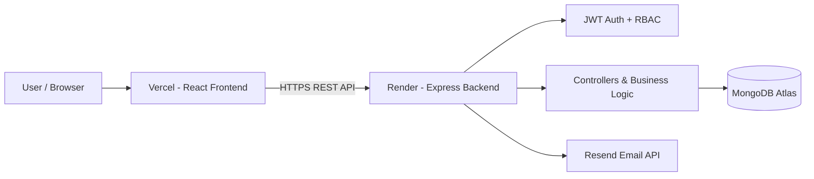

<div align="center">

# SmartDokan

### Retail Management, Inventory & POS — Simplified.

A production-oriented full-stack retail management platform for managing products, inventory, sales, purchases, customers, suppliers, expenses, reports, notifications, and team access from one centralized dashboard.

<br />

[](https://www.mongodb.com/mern-stack)
[](https://react.dev/)
[](https://nodejs.org/)
[](https://expressjs.com/)
[](https://www.mongodb.com/)
[](https://vercel.com/)
[](https://render.com/)

<br />

**[Live Demo](https://smartdokan-mu.vercel.app/)** · **[GitHub Repository](https://github.com/NISHAN75/Smartdokan)** · **[Backend API](https://smartdokan.onrender.com/)**

</div>

---

## Product Snapshot

| Area | Details |
|---|---|
| Application | Retail inventory, sales & business management |
| Architecture | MERN full-stack application |
| Frontend | React 18 + Vite |
| Backend | Node.js + Express |
| Database | MongoDB + Mongoose |
| Authentication | JWT + httpOnly cookie sessions |
| Authorization | Admin / Manager / Staff |
| Email | Resend HTTP API integration |
| Frontend Hosting | Vercel |
| Backend Hosting | Render |
| Database Hosting | MongoDB Atlas |

## Why SmartDokan?

Small retail businesses often depend on notebooks, spreadsheets, disconnected tools, and manual calculations. SmartDokan brings the core workflow into one system so a shop can track what is being bought, sold, stocked, owed, and spent without maintaining separate records.

| Traditional problem | SmartDokan solution |
|---|---|
| Manual stock tracking | Centralized inventory with stock movement history |
| Difficult sales tracking | POS checkout and sales history |
| Supplier due confusion | Supplier balances and payment records |
| Customer due tracking | Customer records and running balances |
| Manual expense records | Categorized expense management |
| Limited business visibility | Dashboard and reporting modules |
| Shared account access | Role-based Admin / Manager / Staff access |

---

## Core Features

### 🔐 Authentication & Account Security

- JWT-based authentication
- httpOnly cookie sessions for browser authentication
- Login and logout
- Protected frontend routes
- Server-side authentication middleware
- Password hashing with bcryptjs
- Email verification flow
- Forgot-password and reset-password flow
- Active/inactive account checks
- Safe production error responses

### 👥 Role-Based Access Control

SmartDokan separates operational access from administrative user management.

| Role | Access model |
|---|---|
| **Admin** | Full application access, including user management |
| **Manager** | Business operations without admin-only user management |
| **Staff** | Day-to-day operational workflows without admin-only user management |

Authorization is enforced on the backend as well as through frontend route/navigation guards. The user-management API is restricted to admins, and the application protects the last active admin from accidental removal.

### 👤 User Management

Admin-only user management includes:

- User listing and search
- Role filtering
- User creation
- Role assignment
- Profile updates
- Activate/deactivate accounts
- Protection against removing the last active admin

### 📦 Products & Categories

- Product and category CRUD
- Search and filtering
- Pagination
- Product information and stock-related data

### 📊 Inventory & Stock Movements

- Live stock overview
- In-stock / low-stock / out-of-stock visibility
- Stock In
- Stock Out
- Stock Adjustment
- Auditable stock movement ledger

Stock changes are represented through the movement workflow instead of relying on uncontrolled direct edits.

### 🛒 Sales / POS

- Product search
- Cart-based checkout
- Discounts
- Multiple payment methods
- Printable invoices
- Sales history
- Stock deduction through inventory movement logic

### 🧾 Purchases

- Supplier purchase recording
- Purchase details and history
- Purchase payment tracking
- Stock increases from purchases
- Supplier due tracking
- Inactive-supplier protection in the purchase flow

### 🤝 Customers & Suppliers

- Customer records
- Customer sales/history
- Customer balance tracking
- Supplier records
- Supplier purchase history
- Supplier payment history
- Supplier running due/balance tracking
- Opening due support for suppliers

### 💸 Expenses

- Expense categories
- Expense recording
- Business expense history

### 📈 Dashboard & Reports

- Business summary information
- Sales-related reporting
- Stock visibility
- Financial/business reporting endpoints

### 🔔 Notifications

- In-app notifications
- Operational alerts such as low-stock notifications

### ⚙️ Settings

- Per-user settings
- Profile/password-related settings
- Business preferences

---

## System Architecture



### Production flow

```text
User
  ↓
Vercel
React Frontend
  ↓ HTTPS / REST API
Render
Express Backend
  ↓
MongoDB Atlas

Express Backend
  ↓
Resend
Transactional Email
```

---

## Application Modules

| Module | Purpose |
|---|---|
| Authentication | Identity, sessions, verification and password recovery |
| User Management | Admin-controlled team accounts and roles |
| Products | Product catalog management |
| Categories | Product organization |
| Inventory | Current stock visibility |
| Stock Movements | Auditable stock ledger |
| Sales / POS | Retail checkout and sales history |
| Purchases | Supplier purchasing and payment tracking |
| Customers | Customer records and balances |
| Suppliers | Supplier records, purchases and payments |
| Expenses | Business expense tracking |
| Reports | Business reporting |
| Dashboard | Operational summary |
| Notifications | In-app operational alerts |
| Settings | User and business preferences |

---

## Role & Access Matrix

The exact permissions should remain governed by the backend authorization layer. The current admin-only surface is User Management.

| Feature | Admin | Manager | Staff |
|---|:---:|:---:|:---:|
| Dashboard | ✓ | ✓ | ✓ |
| Products | ✓ | ✓ | ✓ |
| Categories | ✓ | ✓ | ✓ |
| Inventory | ✓ | ✓ | ✓ |
| Stock Movements | ✓ | ✓ | ✓ |
| Sales / POS | ✓ | ✓ | ✓ |
| Purchases | ✓ | ✓ | ✓ |
| Customers | ✓ | ✓ | ✓ |
| Suppliers | ✓ | ✓ | ✓ |
| Expenses | ✓ | ✓ | ✓ |
| Reports | ✓ | ✓ | ✓ |
| Settings | ✓ | ✓ | ✓ |
| User Management | ✓ | — | — |

> **Security principle:** hiding a frontend link is not the security boundary. Admin-only access is enforced server-side with authentication and role authorization.

---

## Tech Stack

### Frontend

- React 18
- Vite
- React Router
- TanStack Query
- Axios
- Tailwind CSS
- Lucide React

### Backend

- Node.js
- Express.js
- MongoDB
- Mongoose
- JWT
- bcryptjs
- cookie-parser
- CORS
- Resend HTTP API

### Deployment

- Vercel — frontend
- Render — backend
- MongoDB Atlas — database
- Resend — transactional email

---

## Security

SmartDokan applies several practical security controls across the application:

- JWT authentication
- httpOnly authentication cookies
- bcrypt password hashing
- Protected API routes
- Server-side role authorization
- Frontend protected routes
- Active-user checks
- Email verification before login
- Password reset tokens with expiry
- Last-active-admin protection
- Environment variables for secrets
- CORS configuration based on the deployed frontend origin
- Production error handling that avoids exposing development stack traces

Secrets such as MongoDB credentials, JWT secrets, and Resend API keys must never be committed to Git.

---

## Project Structure

```text
Smartdokan/
├── backend/
│   ├── config/             # Database configuration
│   ├── controllers/        # Route handlers and business logic
│   ├── middleware/         # Authentication and error handling
│   ├── models/             # Mongoose schemas
│   ├── routes/             # Express API routes
│   ├── utils/              # Tokens, email and shared helpers
│   └── server.js           # Express application entry point
│
├── frontend/
│   ├── src/
│   │   ├── api/            # API request functions
│   │   ├── components/     # Reusable UI components
│   │   ├── context/        # Global auth context
│   │   ├── hooks/          # React Query/application hooks
│   │   ├── layouts/        # Dashboard shell
│   │   └── pages/          # Route-level screens
│   └── vite.config.js
│
└── README.md
```

---

## Getting Started Locally

### Prerequisites

- Node.js 18+
- MongoDB local instance or MongoDB Atlas
- Resend API key for email verification/password recovery

### 1. Clone the repository

```bash
git clone https://github.com/NISHAN75/Smartdokan.git
cd Smartdokan
```

### 2. Backend

```bash
cd backend
npm install
npm run dev
```

Create `backend/.env`:

```env
PORT=5000
NODE_ENV=development
MONGO_URI=<your-mongodb-connection-string>
JWT_SECRET=<your-long-random-secret>
JWT_EXPIRE=7d
CLIENT_URL=http://localhost:5173
RESEND_API_KEY=<your-resend-api-key>
RESEND_FROM=SmartDokan <onboarding@resend.dev>
```

Backend API:

```text
http://localhost:5000/api
```

### 3. Frontend

Open another terminal:

```bash
cd frontend
npm install
npm run dev
```

Create `frontend/.env`:

```env
VITE_API_URL=http://localhost:5000/api
```

Frontend:

```text
http://localhost:5173
```

---

## Environment Variables

### Backend

| Variable | Purpose |
|---|---|
| `PORT` | Express server port |
| `NODE_ENV` | Runtime environment |
| `MONGO_URI` | MongoDB connection string |
| `JWT_SECRET` | JWT signing secret |
| `JWT_EXPIRE` | JWT lifetime |
| `CLIENT_URL` | Allowed frontend origin / production client URL |
| `RESEND_API_KEY` | Resend API authentication |
| `RESEND_FROM` | Email sender address |

### Frontend

| Variable | Purpose |
|---|---|
| `VITE_API_URL` | Backend `/api` base URL |

> Never put private API keys or database credentials in the frontend environment.

---

## Authentication Flow

```text
Register
   ↓
Create account
   ↓
Send verification email
   ↓
Verify email
   ↓
Login
   ↓
JWT httpOnly cookie
   ↓
Protected application
```

Password recovery:

```text
Forgot Password
   ↓
Request reset email
   ↓
Time-limited reset token
   ↓
Set new password
   ↓
Login again
```

---

## API Overview

All API routes are mounted under `/api`.

| Base path | Covers |
|---|---|
| `/auth` | Register, login, logout, current session, email verification and password recovery |
| `/users` | User management — admin only |
| `/categories` | Product categories |
| `/products` | Product catalog |
| `/inventory` | Current inventory overview |
| `/stock-movements` | Stock In / Out / Adjustment ledger |
| `/sales` | POS checkout and sales history |
| `/purchases` | Supplier purchases |
| `/customers` | Customer records |
| `/suppliers` | Supplier records and payments |
| `/expenses` | Business expenses |
| `/expense-categories` | Expense categories |
| `/reports` | Reporting endpoints |
| `/dashboard` | Dashboard summary |
| `/notifications` | In-app notifications |
| `/settings` | User/business settings |

Authentication-sensitive endpoints are protected through the existing `protect` middleware, while admin-only user management is protected through `authorize('admin')`.

---

## Deployment

### Frontend — Vercel

Set:

```env
VITE_API_URL=https://smartdokan.onrender.com/api
```

### Backend — Render

Set:

```env
NODE_ENV=production
MONGO_URI=<mongodb-atlas-uri>
JWT_SECRET=<production-secret>
JWT_EXPIRE=7d
CLIENT_URL=https://smartdokan-mu.vercel.app
RESEND_API_KEY=<resend-api-key>
RESEND_FROM=SmartDokan <onboarding@resend.dev>
```

The deployed backend health endpoint is:

**https://smartdokan.onrender.com/**

Expected response:

```json
{"success":true,"message":"SmartDokan API is running"}
```

### Cross-origin authentication

Because the frontend and backend are hosted on different domains, production authentication depends on correct CORS and cookie settings. `CLIENT_URL` must match the deployed Vercel origin exactly and should not contain a trailing slash.

### Resend sender note

The shared `onboarding@resend.dev` sender is useful for testing, but Resend restricts shared-sender delivery. For unrestricted production email delivery, verify a domain in Resend and use a sender address from that domain.

---

## Verification & Build Checks

The frontend production build can be generated with:

```bash
cd frontend
npm run build
```

Backend development server:

```bash
cd backend
npm run dev
```

For production troubleshooting, check the Render logs for backend errors and the browser Network/Console panel for frontend/API errors.

---

## Roadmap

Potential future improvements:

- Barcode scanner integration
- More advanced analytics and dashboards
- PDF invoice/export improvements
- Multi-branch support
- Detailed audit logs
- Automated database backup workflows
- More granular per-module permissions
- Advanced notification preferences

These are future improvements, not claims of currently implemented functionality.

---

## Developer

### Nishan Das

Full-Stack / Frontend Developer

- **GitHub:** https://github.com/NISHAN75
- **Portfolio:** https://nishandas.netlify.app/

---

## License

**Private project — all rights reserved.**

---

<div align="center">

### SmartDokan

**One dashboard for the everyday operations of a retail shop.**

[Live Demo](https://smartdokan-mu.vercel.app/) · [Source Code](https://github.com/NISHAN75/Smartdokan)

</div>
